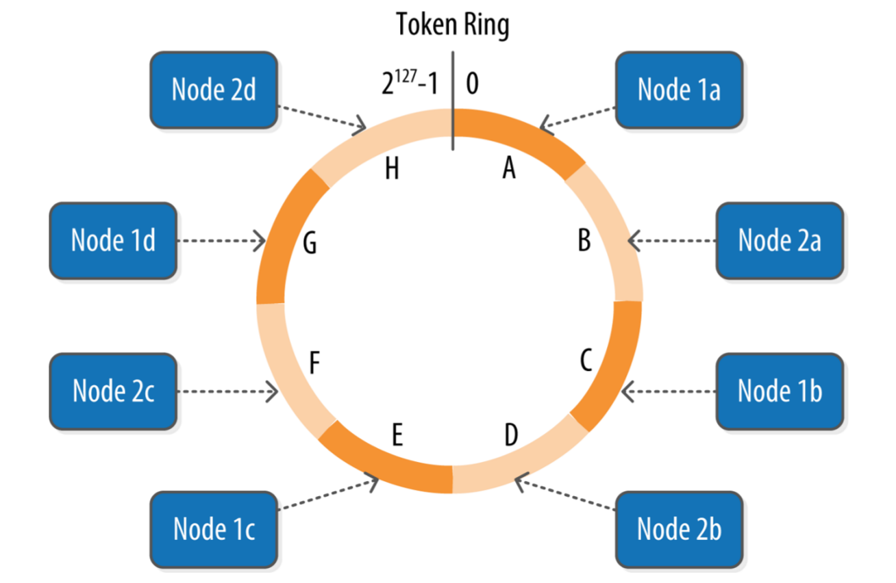
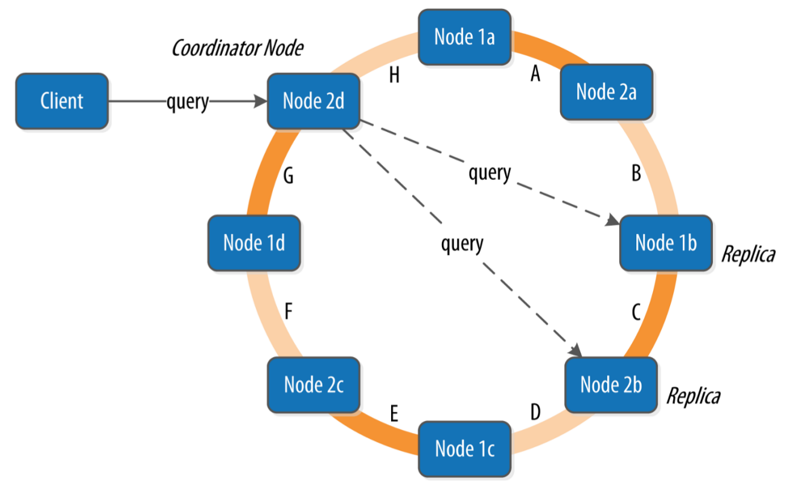
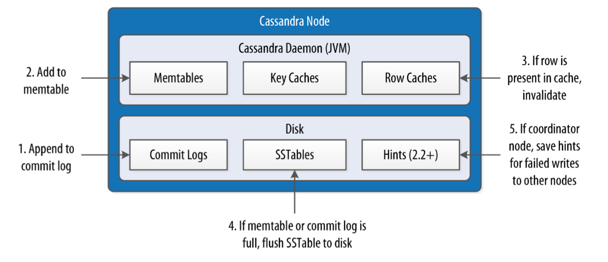
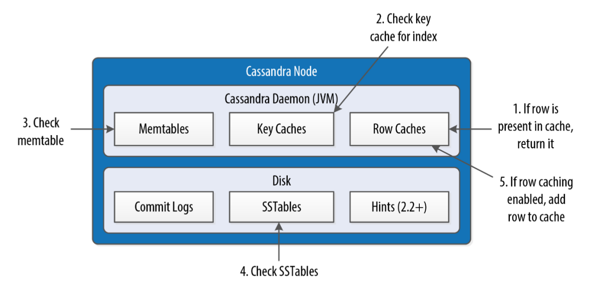

# Cassandra

> **Cassandra** is a distributed database for managing large amounts of structured data across many commodity servers, while providing highly available service and no single point of failure

Useful documentation

* [Cassandra](https://cassandra.apache.org)

* [A Decentralized Structured Storage System](https://www.cs.cornell.edu/projects/ladis2009/papers/lakshman-ladis2009.pdf) (Paper)

* [A Big Data Modeling Methodology for Apache Cassandra](https://pdfs.semanticscholar.org/22c6/740341ef13d3c5ee52044a4fbaad911f7322.pdf) (Paper)

* [Facebook’s Cassandra paper](https://docs.datastax.com/en/articles/cassandra/cassandrathenandnow.html)

* [Cassandra Data Modeling Best Practices](https://www.ebayinc.com/stories/blogs/tech/cassandra-data-modeling-best-practices-part-1)

* [Difference between partition key, composite key and clustering key](https://stackoverflow.com/questions/24949676/difference-between-partition-key-composite-key-and-clustering-key-in-cassandra)

* [Cassandra Cluster Manager](https://github.com/riptano/ccm)

<!-- * [Cassandra Modeling Kata](https://github.com/allegro/cassandra-modeling-kata) -->

Cassandra uses a tick-tock release model, even-numbered releases are feature releases, while odd-numbered releases are focused on bug fixes

## Architecture

* A **rack** is a logical set of nodes in close proximity to each other

* A **data center** is a logical set of racks

* Cassandra uses a **gossip protocol** (called epidemic protocol) that allows each node to keep track of state information about the other nodes in the cluster implementing an algorithm called *Phi Accrual Failure Detection* instead of simple heartbeats

* The job of a **snitch** is to determine relative host proximity for each node in a cluster, which is used to determine which nodes to read and write from

* Cassandra represents the data managed by a cluster as a **ring**. Each node in the ring is assigned one or more ranges of data described by a **token**, which determines its position in the ring and is used to identify each partition



* **virtual nodes** allow to break a token range and assign multiple tokens to a single physical node

* A **partitioner** is a hash function for computing the token of a partition key and determines how a (wide) row or partition of data is distributed within the ring

* The **replication factor** is the number of nodes in a cluster that will receive copies of the same row and the replication strategy is set independently for each keyspace

* Cassandra provides tuneable **consistency** levels and must be specified on each read or write

* A client may connect to any node in the cluster, named **coordinator node**, to initiate a read or write query. The coordinator identifies which nodes are replicas for the data and forwards the queries to them



* When a write operation is performed, it's immediately written to a **commit log** to ensure that data is not lost. It is a crash-recovery mechanism only, clients never read from it

* After it's written to the commit log, the value is written (already ordered) to a memory-resident data structure called the **memtable** divided by Column Family (table)

* When the number of objects stored in the memtable or in the commit log reaches a threshold, the contents of the memtable are flushed (non-blocking operation) to disk in a file called **SSTable** and a new memtable or commit log is then created/recycled

* No reads or seeks of any kind are required for writing a value to Cassandra because all writes are append operations to immutable SSTables. However, periodic **compaction** operations in Cassandra are performed in order to support fast read performance: the keys are merged, columns are combined, tombstones are discarded, and a new index is created

* The **key cache** stores a map of partition keys to row index entries, facilitating faster read access into SSTables stored on disk. The key cache is stored on the JVM heap

* The **row cache** caches entire rows and can greatly speed up read access for frequently accessed rows, at the cost of more memory usage. The row cache is stored in off-heap memory

* The **counter cache** is used to improve counter performance by reducing lock contention for the most frequently accessed counters

* In a scenario in which a write request is sent to Cassandra, but a replica node where the write properly belongs is not available due to network partition, hardware failure, or some other reason, to ensure general availability Cassandra implements a feature called **hinted handoff**. The coordinator node while store temporarily the data until it detects that the node is available again

*Write Path*


*Read Path*


* To provide *linearizable consistency* e.g. read-before-write, Cassandra supports a **lightweight transaction** or LWT. The implementation is based on *paxos* and is limited to a single partition

* A **tombstone** is a deletion marker that is required to suppress older data in SSTables until compaction or garbage collection run. Data is not immediately deleted but it's treated as an update operation

* **Bloom filters** are very fast, non-deterministic algorithms for testing whether an element is a member of a set. It is possible to get a false-positive read, but not a false-negative. When a read is performed, the filter is checked first before accessing disk, if it indicates that the element does not exist in the set, it certainly doesn't, but if the filter thinks that the element is in the set, the disk is accessed to make sure

* *Replica Synchronization (1)* Cassandra reads data from multiple replicas in order to achieve the requested consistency level and detects if any replicas have out of date values. If an insufficient number of nodes have the latest value, a **read repair** is performed immediately to update the out of date replicas

* *Replica Synchronization (2)* **Anti-entropy repair** is a manually initiated operation performed on nodes as part of a regular maintenance process executed with *nodetool* causing a *major compaction* during which a node exchange *Merkle trees* with neighboring nodes

## Setup

Single Node Cluster
```bash
# change path
cd devops/cassandra

# start single node
docker-compose up

# paths
/etc/cassandra
/var/lib/cassandra
/var/log/cassandra

# remove container and volume
docker rm -fv devops-cassandra
```

Multi Node Cluster
```bash
# change path
cd devops/cassandra

# start node
docker-compose -f docker-compose-cluster.yml up

# optional mounted volumes
mkdir -p \
  .cassandra/cassandra-seed/{data,log} \
  .cassandra/cassandra-node-1/{data,log} \
  .cassandra/cassandra-node-2/{data,log}
tree .cassandra/

# ISSUES releated to host permissions
# > Small commitlog volume detected at /var/lib/cassandra/commitlog
# > There is insufficient memory for the Java Runtime Environment to continue
(cassandra) /var/lib/cassandra
(root) /var/log/cassandra
```

Access container
```bash
# access container
docker exec -it devops-cassandra bash
docker exec -it devops-cassandra bash -c cqlsh
docker exec -it devops-cassandra-seed bash
docker exec -it devops-cassandra-node-1 bash

# execute cql script from host
(docker exec -i devops-cassandra bash \
  -c "cat > example.cql; cqlsh -f example.cql") < cql/example_create.cql
```

## CQL

`cqlsh` script [examples](https://github.com/niqdev/devops/tree/master/cassandra/cql)

```bash
# connect
cqlsh localhost 9042
cqlsh localhost 9042 -u cassandra -p cassandra

# execute cql script
cqlsh -f cql/example_create.cql

# info
SHOW VERSION;
DESCRIBE CLUSTER;
DESCRIBE KEYSPACES;
DESCRIBE KEYSPACE example;
DESCRIBE TABLE example.messages;

# nice format
EXPAND ON;
# trace query
TRACING ON;

# bulk loading
COPY example.users TO '/cql/users.csv' WITH HEADER=TRUE;
COPY example.users FROM '/cql/all_users.csv' WITH DELIMITER = ';';
COPY example.users (first_name,last_name,addresses,emails,enable) FROM '/cql/column_users.csv' WITH HEADER=TRUE;

# automatic paging
PAGING;
PAGING ON;
PAGING 100;
# limit
SELECT * FROM example.users LIMIT 1;
```

* [Batch](https://docs.datastax.com/en/cql/3.3/cql/cql_using/useBatch.html)
* [User-Defined Type](https://docs.datastax.com/en/dse/6.0/cql/cql/cql_using/useCreateUDT.html)
* [User-Defined Function](https://docs.datastax.com/en/cql/3.3/cql/cql_using/useCreateUDF.html)
* [User-Defined Aggregate Function](https://docs.datastax.com/en/cql/3.3/cql/cql_using/useCreateUDA.html)

Old `cassandra-cli` deprecated and removed in Cassandra 3.0

```
USE keyspace_name;
LIST table_name;
GET table_name["primary_key"];
SET table_name["primary_key"]["column_name"];
```

<br>
