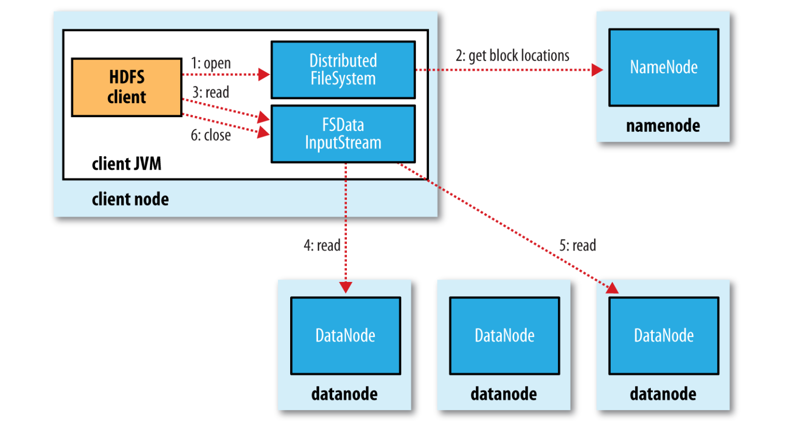
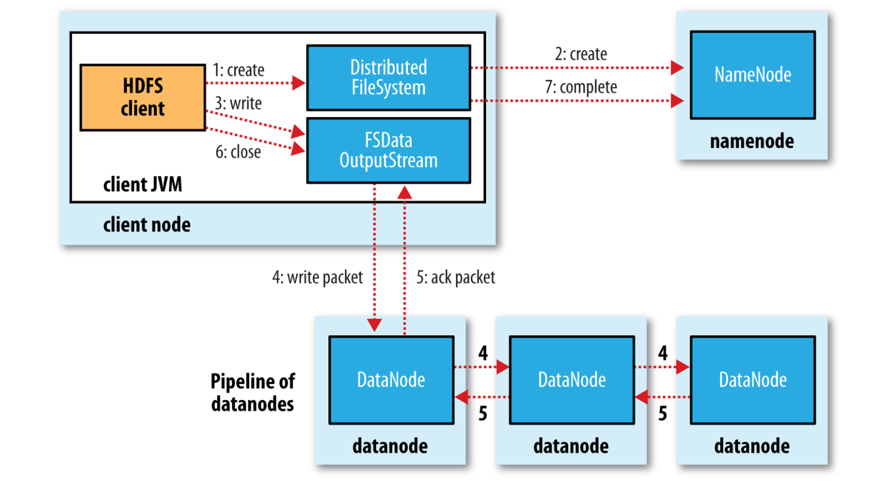
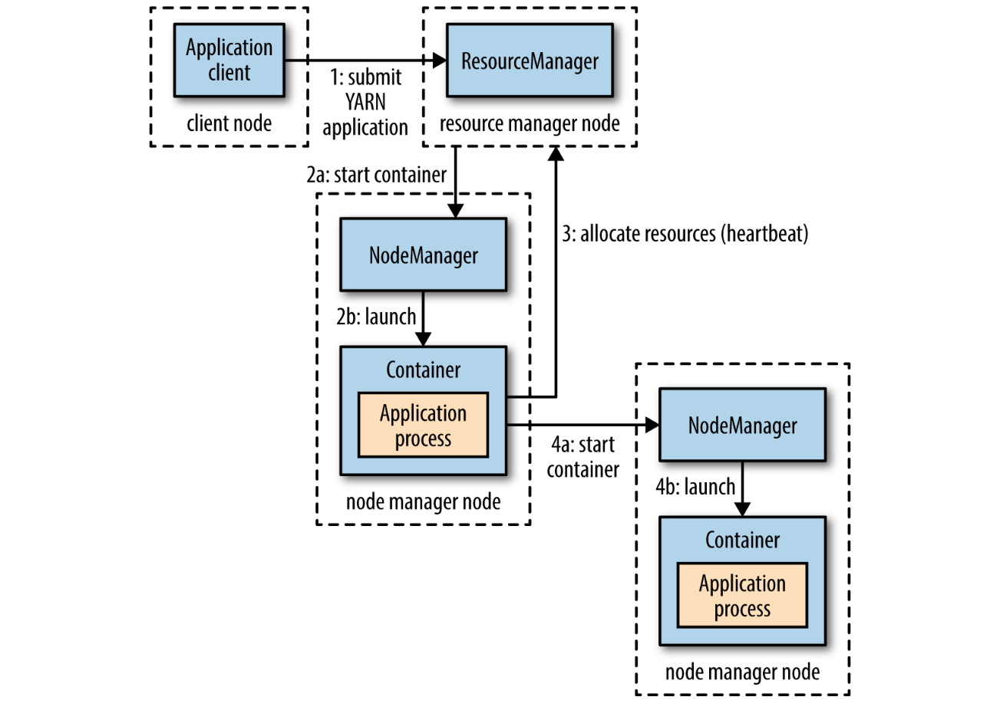
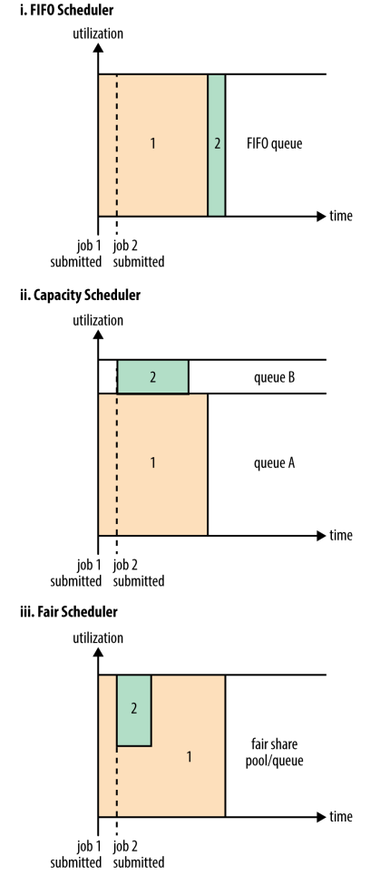
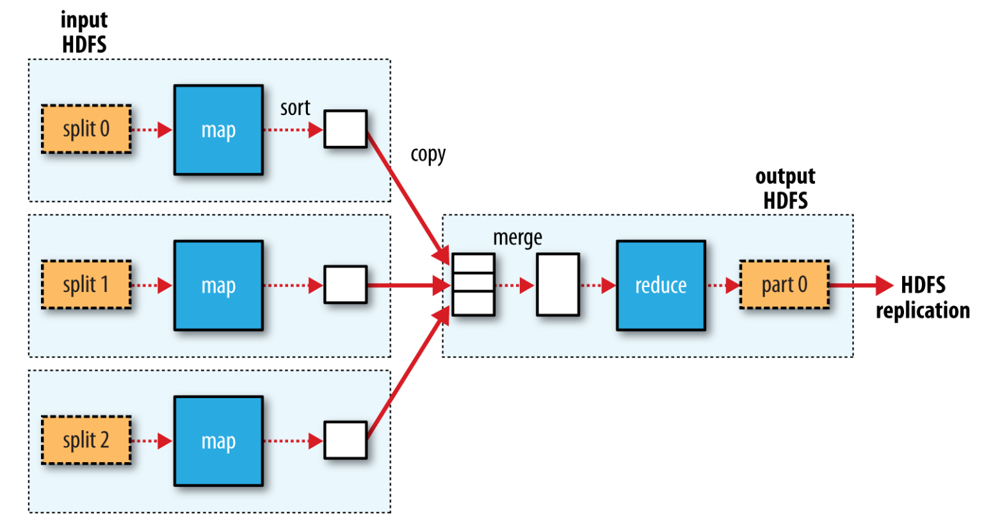
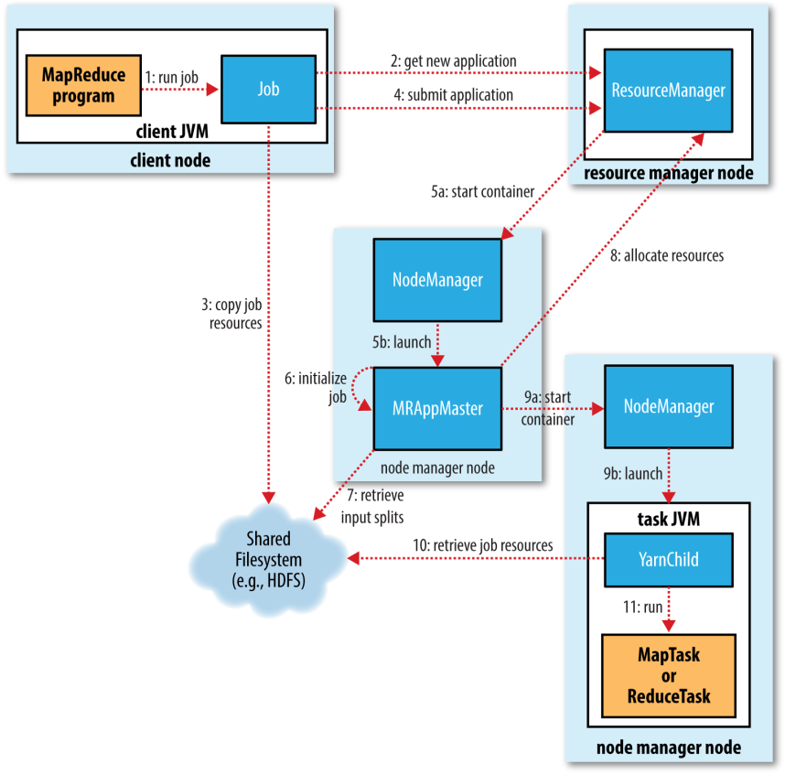
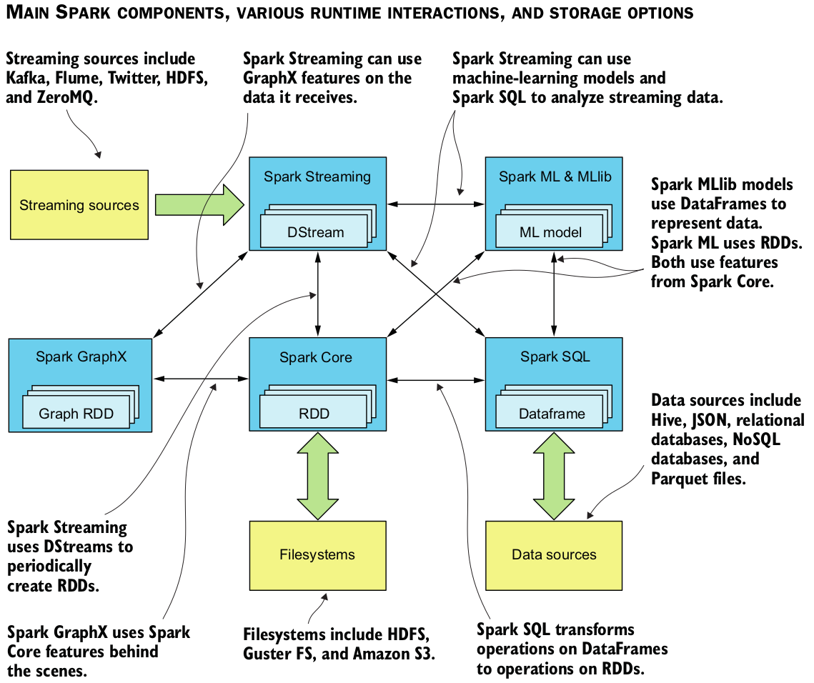
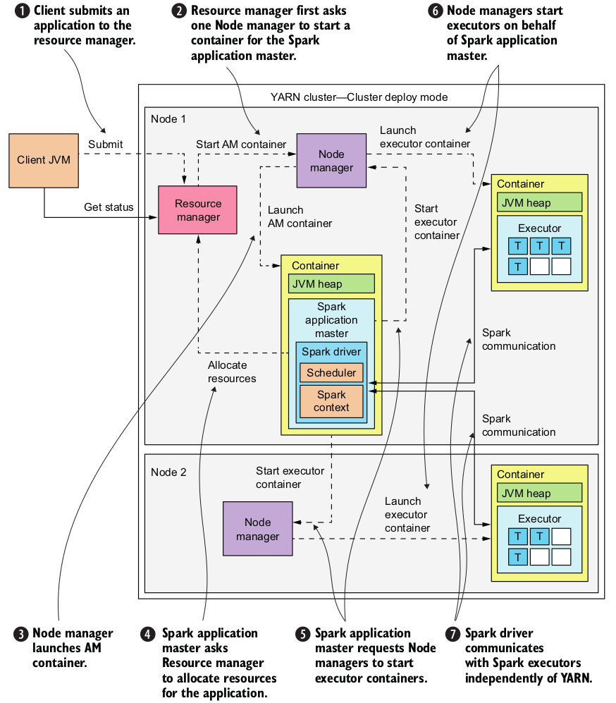

# Hadoop

The following guide explains how to provision a Multi Node Hadoop Cluster locally and play with it. Checkout the [Vagrantfile](https://github.com/niqdev/devops/blob/master/hadoop/Vagrantfile) and the Vagrant [guide](other/#vagrant) for more details.

Documentation

* [Hadoop](https://hadoop.apache.org)
* [The Hadoop Ecosystem Table](https://hadoopecosystemtable.github.io)
* [Hadoop Internals](https://ercoppa.github.io/HadoopInternals)

### Setup

Requirements

* [Vagrant](https://www.vagrantup.com)
* [VirtualBox](https://www.virtualbox.org)

Directory structure
```bash
tree -a hadoop/
hadoop/
├── .data # mounted volume
│   ├── hadoop_rsa
│   ├── hadoop_rsa.pub
│   ├── master
│   │   ├── hadoop
│   │   │   ├── log
│   │   │   │   ├── hadoop
│   │   │   │   ├── mapred
│   │   │   │   └── yarn
│   │   │   ├── namenode
│   │   │   └── secondary
│   │   ├── oozie
│   │   │   ├── data
│   │   │   └── log
│   │   ├── spark
│   │   │   └── log
│   │   └── zeppelin
│   │       ├── log
│   │       └── notebook
│   ├── node-1
│   │   └── hadoop
│   │       ├── datanode
│   │       └── log
│   │           ├── hadoop
│   │           ├── mapred
│   │           └── yarn
│   ├── node-2
│   ├── node-3
├── example
│   ├── map-reduce
│   └── spark
├── file
│   ├── hadoop
│   │   ├── config
│   │   │   ├── core-site.xml
│   │   │   ├── fair-scheduler.xml
│   │   │   ├── hdfs-site.xml
│   │   │   ├── mapred-site.xml
│   │   │   ├── masters
│   │   │   ├── slaves
│   │   │   └── yarn-site.xml
│   │   └── profile-hadoop.sh
│   ├── hosts
│   ├── motd
│   ├── oozie
│   │   ├── config
│   │   │   ├── oozie-env.sh
│   │   │   └── oozie-site.xml
│   │   └── profile-oozie.sh
│   ├── spark
│   │   ├── config
│   │   │   ├── log4j.properties
│   │   │   └── spark-env.sh
│   │   └── profile-spark.sh
│   ├── ssh
│   │   └── config
│   └── zeppelin
│       ├── config
│       │   └── zeppelin-env.sh
│       └── profile-zeppelin.sh
├── script
│   ├── bootstrap.sh
│   ├── setup_hadoop.sh
│   ├── setup_oozie.sh
│   ├── setup_spark.sh
│   ├── setup_ubuntu.sh
│   └── setup_zeppelin.sh
├── Vagrantfile
└── vagrant_hadoop.sh
```

Import the script
```bash
source vagrant_hadoop.sh
```

Create and start a Multi Node Hadoop Cluster
```bash
hadoop-start
```
*The first time it might take a while*

Access the cluster via ssh, check also the [/etc/hosts](https://github.com/niqdev/devops/blob/master/hadoop/file/hosts) file
```bash
vagrant ssh master
ssh hadoop@172.16.0.10 -i .data/hadoop_rsa

# 3 nodes
vagrant ssh node-1
ssh hadoop@172.16.0.101 -i .data/hadoop_rsa
```

Destroy the cluster
```bash
hadoop-destroy
```

For convenience add to the host machine
```bash
cat hadoop/file/hosts | sudo tee --append /etc/hosts
```

Web UI links

* NameNode: [http://namenode.local:50070](http://172.16.0.10:50070)
* NameNode metrics: [http://namenode.local:50070/jmx](http://172.16.0.10:50070/jmx)
* ResourceManager: [http://resource-manager.local:8088](http://172.16.0.10:8088)
* Log Level: [http://resource-manager.local:8088/logLevel](http://172.16.0.10:8088/logLevel)
* Web Application Proxy Server: [http://web-proxy.local:8100/proxy/application_XXX_0000](http://172.16.0.10:8100/proxy/application_XXX_0000)
* MapReduce Job History Server: [http://history.local:19888](http://172.16.0.10:19888)
* DataNode/NodeManager (1): [http://node-1.local:8042/node](http://172.16.0.101:8042/node)
* DataNode/NodeManager (2): [http://node-2.local:8042/node](http://172.16.0.102:8042/node)
* DataNode/NodeManager (3): [http://node-3.local:8042/node](http://172.16.0.103:8042/node)
* Spark: [http://spark.local:4040](http://172.16.0.10:4040)
* Spark History Server: [http://spark-history.local:18080](http://172.16.0.10:18080)
* Zeppelin (*): [http://zeppelin.local:8080](http://172.16.0.10:8080)
* Oozie (*): [http://oozie.local:11000](http://172.16.0.10:11000)

*(\*) Not installed by default*

## HDFS and MapReduce

> **HDFS** is a distributed file system that provides high-throughput access to application data

Anatomy of a File Read



Anatomy of a File Write



> **YARN** is a framework for job scheduling and cluster resource management

Anatomy of a YARN Application Run



YARN's schedulers



> **MapReduce** is a YARN-based system for parallel processing of large data sets

MapReduce data flow



MapReduce application on YARN



Documentation

* [Hadoop v2.7.6](http://hadoop.apache.org/docs/r2.7.6)
* [Untangling Apache Hadoop YARN](http://blog.cloudera.com/blog/2015/09/untangling-apache-hadoop-yarn-part-1/) series

### Admin

HDFS cli
```bash
# help
hdfs

# filesystem statistics
hdfs dfsadmin -report

# filesystem check
hdfs fsck /
```

YARN cli
```bash
# help
yarn

# list yarn applications
yarn application -list

# kill yarn applications
yarn application -kill application_XXX
```

Useful paths
```bash
# data and logs
devops/hadoop/.data/master/hadoop # host
/vol/hadoop # guest

# (guest) config
/usr/local/hadoop/etc/hadoop

# (hdfs) map-reduce history
/mr-history/history/done_intermediate/hadoop

# (hdfs) aggregated app logs
/yarn/app/hadoop/logs/application_XXX
```

### MapReduce WordCount Job

```bash
# build jar on the host machine
cd devops/hadoop/example/map-reduce
./gradlew clean build

cd devops/hadoop
vagrant ssh master

# create base directory using hdfs
hdfs dfs -mkdir -p /user/ubuntu

# create example directory
hadoop fs -mkdir -p /user/ubuntu/word-count/input

# list directory
hadoop fs -ls -h -R /
hadoop fs -ls -h -R /user/ubuntu

# create sample files
echo "Hello World Bye World" > file01
echo "Hello Hadoop Goodbye Hadoop" > file02

# copy from local to hdfs
hadoop fs -copyFromLocal file01 /user/ubuntu/word-count/input
hadoop fs -put file02 /user/ubuntu/word-count/input

# verify copied files
hadoop fs -ls -h -R /user/ubuntu
hadoop fs -cat /user/ubuntu/word-count/input/file01
hadoop fs -cat /user/ubuntu/word-count/input/file02
hadoop fs -cat /user/ubuntu/word-count/input/*

# run application
hadoop jar /vagrant/example/map-reduce/build/libs/map-reduce.jar \
  /user/ubuntu/word-count/input \
  /user/ubuntu/word-count/output

# check output
hadoop fs -cat /user/ubuntu/word-count/output/part-r-00000

# delete directory to run it again
hadoop fs -rm -R /user/ubuntu/word-count/output

# run sample job in a different queue
hadoop jar \
  $HADOOP_HOME/share/hadoop/mapreduce/hadoop-mapreduce-examples-*.jar \
  wordcount \
  -Dmapreduce.job.queuename=root.priority_queue \
  /user/ubuntu/word-count/input \
  /user/ubuntu/word-count/output

# well known WARN issue
# https://issues.apache.org/jira/browse/HDFS-10429
```

### Benchmarking MapReduce with TeraSort

```bash
# generate random data
hadoop jar \
  $HADOOP_HOME/share/hadoop/mapreduce/hadoop-mapreduce-examples-*.jar \
  teragen 1000 random-data

# run terasort benchmark
hadoop jar \
  $HADOOP_HOME/share/hadoop/mapreduce/hadoop-mapreduce-examples-*.jar \
  terasort random-data sorted-data

# validate data
hadoop jar \
  $HADOOP_HOME/share/hadoop/mapreduce/hadoop-mapreduce-examples-*.jar \
  teravalidate sorted-data report

# useful commands
hadoop fs -ls -h -R .
hadoop fs -rm -r random-data
hadoop fs -cat random-data/part-m-00000
hadoop fs -cat sorted-data/part-r-00000
```

<br>

## Spark

> **Spark** is an open-source cluster-computing framework

Documentation

* [Spark](https://spark.apache.org/docs/latest)
* [How-to: Tune Your Apache Spark Jobs](http://blog.cloudera.com/blog/2015/03/how-to-tune-your-apache-spark-jobs-part-1) series
* [Understanding Resource Allocation configurations for a Spark application](http://site.clairvoyantsoft.com/understanding-resource-allocation-configurations-spark-application)



Spark application on YARN



```bash
# start REPL
spark-shell
pyspark
```

### Interactive Analysis example

```bash
spark-shell

# view all configured parameters
sc.getConf.getAll.foreach(x => println(s"${x._1}: ${x._2}"))

val licenceLines = sc.textFile("file:/usr/local/spark/LICENSE")
val lineCount = licenceLines.count
val isBsd = (line: String) => line.contains("BSD")
val bsdLines = licenceLines.filter(isBsd)
bsdLines.count
bsdLines.foreach(println)
```

### Spark Job example

```bash
# GitHub event documentation
# https://developer.github.com/v3/activity/events/types

# build jar on the host machine
cd devops/hadoop/example/spark
sbt clean package

cd devops/hadoop
vagrant ssh master

# sample dataset
mkdir -p github-archive && \
  cd $_ && \
  wget http://data.githubarchive.org/2018-01-01-{0..10}.json.gz && \
  gunzip -k *
# sample line
head -n 1 2018-01-01-0.json | jq '.'

# run job
spark-submit \
  --class "com.github.niqdev.App" \
  --master local[*] \
  /vagrant/example/spark/target/scala-2.11/spark-github_2.11-0.1.0-SNAPSHOT.jar
```

<br>

## Zeppelin

> **Zeppelin** is a web-based notebook that enables data-driven, interactive data analytics and collaborative documents with SQL, Scala and more

Documentation

* [Zeppelin](https://zeppelin.apache.org)

### Setup

Install and start Zeppelin
```bash
# access master node
vagrant ssh master

# login as root
sudo su -

# install and init
/vagrant/script/setup_zeppelin.sh

# start manually (first time only)
su --login hadoop /vagrant/script/bootstrap.sh zeppelin
```

### Examples

* [Learning Spark SQL with Zeppelin](https://hortonworks.com/tutorial/learning-spark-sql-with-zeppelin)

```
# markdown interpreter
%md
hello

# shell interpreter
%sh
hadoop fs -ls -h -R /
```

Cluster issue: verify to have enough memory with `free -m` e.g. *Error: Cannot allocate memory*

<br>

## Oozie

> **Oozie** is a workflow scheduler system to manage Hadoop jobs

Documentation

* [Oozie](https://oozie.apache.org)

### Setup

**Optional PostgreSQL configuration** - By default Oozie is configured to use Embedded Derby
```bash
# access master node
vagrant ssh master

# install docker
curl -fsSL get.docker.com -o get-docker.sh && \
  chmod u+x $_ && \
  ./$_ && \
  sudo usermod -aG docker hadoop

# logout and login again to verify docker installation
exit
vagrant ssh master
whoami # hadoop
docker ps -a

# uncomment PostgreSQL configurations
vim devops/hadoop/file/oozie/config/oozie-site.xml # from host
vim /vagrant/file/oozie/config/oozie-site.xml # from guest

# start postgres on guest machine 
docker run \
  --detach \
  --name oozie-postgres \
  -p 5432:5432 \
  -e POSTGRES_DB="oozie-db" \
  -e POSTGRES_USER="postgres" \
  -e POSTGRES_PASSWORD="password" \
  postgres

# permission issue
# https://github.com/docker-library/postgres/issues/116
# --volume /vol/postgres:/var/lib/postgresql/data

# access container
docker exec -it oozie-postgres bash
psql --username=postgres
# list all databases
\list
\connect oozie-db
# list all tables
\dt
# describe table
\d+ wf_jobs
# list workflow
select * from wf_jobs;
```

Install and start Oozie
```bash
# access master node
vagrant ssh master

# login as root
sudo su -

# build, install and init
/vagrant/script/setup_oozie.sh

# start oozie manually (first time only)
su --login hadoop /vagrant/script/bootstrap.sh oozie
```
*It might take a while to build the sources*

Useful paths
```bash
# data and logs
devops/hadoop/.data/master/oozie # host
/vol/oozie # guest

# (guest) config
/usr/local/oozie/conf

# (hdfs) examples
/user/hadoop/examples
```

### Examples

Run bundled examples within distribution
```bash
# examples path
.data/master/oozie/examples # host
/vol/oozie/examples # guest

# access master node as hadoop user
vagrant ssh master

export OOZIE_EXAMPLE_PATH=/vol/oozie/examples
export OOZIE_HDFS_PATH=/user/$(whoami)/examples

# open map-reduce job.properties
vim $OOZIE_EXAMPLE_PATH/apps/map-reduce/job.properties

# edit the following properties
nameNode=hdfs://namenode.local:9000 # fs.defaultFS @ core-site.xml
jobTracker=resource-manager.local:8032 # yarn.resourcemanager.address @ yarn-site.xml
queueName=priority_queue # or default @ fair-scheduler.xml

# upload all the examples
hadoop fs -put $OOZIE_EXAMPLE_PATH $OOZIE_HDFS_PATH

# verify uploaded files
hadoop fs -ls -h -R /user/$(whoami)

# run the map-reduce workflow example
oozie job \
  -oozie http://oozie.local:11000/oozie \
  -config $OOZIE_EXAMPLE_PATH/apps/map-reduce/job.properties \
  -run

# verify status
oozie job -oozie http://oozie.local:11000/oozie -info WORKFLOW_ID

# verify result
hadoop fs -cat $OOZIE_HDFS_PATH/output-data/map-reduce/part-00000

# remove all the examples
hadoop fs -rm -R $OOZIE_HDFS_PATH
```

### Useful commands

* Workflow requires `oozie.wf.application.path` property
* Coordinator requires `oozie.coord.application.path` property

```bash
# verify oozie status
oozie admin \
  -oozie http://oozie.local:11000/oozie \
  -status

# verify workflow or coordinator status
oozie job \
  -oozie http://oozie.local:11000/oozie \
  -info JOB_ID \
  -verbose

# poll workflow or coordinator status
oozie job \
  -oozie http://oozie.local:11000/oozie \
  -poll JOB_ID \
  -interval 10 \
  -timeout 60 \
  -verbose

# find running coordinator
oozie jobs \
  -oozie http://oozie.local:11000/oozie/ \
  -filter status=RUNNING \
  -jobtype coordinator

# suspend|resume|kill coordinator
oozie job \
  -oozie http://oozie.local:11000/oozie/ \
  [-suspend|-resume|-kill] \
  XXX-C

# re-run coordinator's workflow (action)
oozie job \
  -oozie http://oozie.local:11000/oozie/ \
  -rerun XXX-C \
  -action 1,2,3,N

# kill workflow
oozie job \
  -oozie http://oozie.local:11000/oozie/ \
  -kill \
  XXX-W

# re-run all workflow's actions
oozie job \
  -oozie http://oozie.local:11000/oozie/ \
  -rerun \
  XXX-W \
  -Doozie.wf.rerun.failnodes=false
```

<br>
