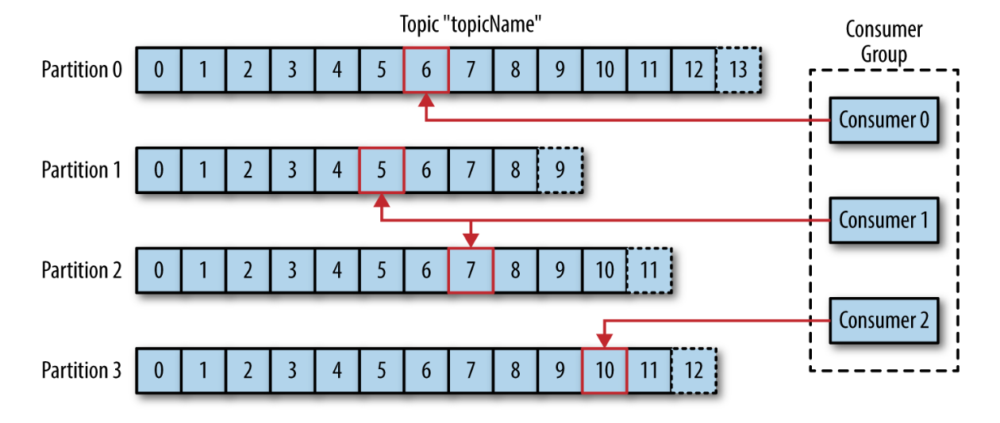
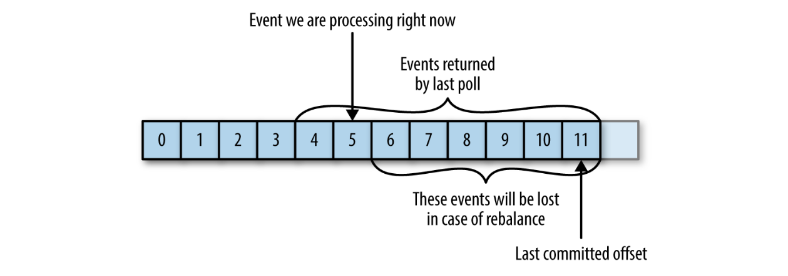

# Kafka

> **Kafka** is a distributed streaming platform

Documentation

* [Kafka](https://kafka.apache.org)

* [Kafka: a Distributed Messaging System for Log Processing](http://notes.stephenholiday.com/Kafka.pdf) (Paper)

* [Schema Registry](https://docs.confluent.io/current/schema-registry/docs/index.html)

* [Reactive Kafka](https://doc.akka.io/docs/akka-stream-kafka/current/home.html)

* [kafkacat](https://github.com/edenhill/kafkacat)

## Architecture

* Kafka is a publish/subscribe messaging system often described as a *distributed commit log* or *distributing streaming platform*

* The unit of data is called a **message**, which is simply an array of bytes and it can have a **key** used to assign partitions. A **batch** is a collection of messages, all of which are being produced to the same topic and partition

* Messages are categorized into **topics** which are additionally broken down into a number of **partitions**. Each partition is splitted into **segments** for storage purposes and each segment is stored in a single data file which contains messages and their offsets

* Messages are written in an append-only fashion and are read in order from beginning to end. As a topic typically has multiple partitions, there is no guarantee of message time-ordering across the entire topic, just within a single partition

* In order to help brokers quickly locate the message for a given offset, Kafka maintains an **index** for each partition. The index maps offsets to segment files and positions within the file

* A **stream** is considered to be a single topic of data, regardless of the number of partitions

* **Producers**, publishers or writers, create new messages to a specific topic. By default, the producer does not care what partition a specific message is written to and will balance messages over all partitions of a topic evenly


* **Consumers**, subscribers or readers, read messages. The consumer subscribes to one or more topics and reads the messages in the order in which they were produced. The consumer keeps track of which messages it has already consumed by keeping track of the **offset** of messages i.e. an integer value that continually
increases. Each message in a given partition has a unique offset stored either in Zookeeper or in Kafka itself



* Consumers work as part of a **consumer group**, which is one or more consumers that work together to consume a topic. The group assures that each partition is only consumed by one member. The mapping of a consumer to a partition is often called **ownership** of the partition by the consumer

* When a new consumer is added to a group, or when a consumer shuts down or crashes leaving the group, it cause reassignment of partitions to other consumers. Moving partition ownership from one consumer to another is called a **rebalance** which provide high availability and scalability

* Consumers maintain membership in a consumer group and ownership of the partitions assigned to them by sending **heartbeats** to a Kafka broker designated as the **group coordinator**

* You can't have multiple consumers that belong to the same group in one thread and you can't have multiple threads safely use the same consumer


* Consumers must keep polling or they will be considered dead and the partitions they are consuming will be handed to another consumer in the group to continue consuming. Consumers **commit** (track) their offset (position) in each partition to a special `__consumer_offsets` topic. If a consumer crashes or a new consumer joins the consumer group, this will trigger a rebalance. After a rebalance, each consumer may be assigned a new set of partitions than the one it processed before. In order to know where to pick up the work, the consumer will read the latest committed offset of each partition and continue from there




* A single Kafka server is called a **broker**. The broker receives messages from producers, assigns offsets to them, and commits the messages to storage on disk. It also services consumers, responding to fetch requests for partitions and responding with the messages that have been committed to disk

* Kafka brokers are designed to operate as part of a **cluster**. A partition is owned by a single broker in the cluster and that broker is called the **leader** of the partition. A partition may be assigned to multiple brokers, which will result in the partition being replicated. All events are produced to and consumed from the *leader* replica. Other *follower* replicas just need to stay **in-sync** with the leader and replicate all the recent events on time

* Kafka uses **Zookeeper** to maintain the list of brokers that are currently members of a cluster. Every time a broker process starts, it registers itself with a unique identifier by creating an [ephemeral node](http://zookeeper.apache.org/doc/current/zookeeperProgrammers.html#Ephemeral+Nodes). Kafka uses Zookeeper's ephemeral node feature to elect a **controller**. The controller is responsible for electing leaders among the partitions and replicas whenever it notices nodes join and leave the cluster


* Data in Kafka is organized by topics. Each topic is partitioned and each partition can have multiple **replicas**. Those replicas are stored on brokers and each broker stores replicas belonging to different topics and partitions

* A key feature is that of **retention**. Brokers are configured with a default retention setting for topics, either retaining messages for some period of *time* or until the topic reaches a certain *size* in bytes. Once these limits are reached, messages are expired and deleted

* **MirrorMaker** is a tool to coordinates multiple clusters or datacenters and replicate data

## Setup

Requirements

* [Base](docker/#base-image) docker image 
* [ZooKeeper](zookeeper) docker image

Build `devops/kafka` image
```bash
# change path
cd devops/kafka

# build image
docker build -t devops/kafka .

# create network
docker network create --driver bridge my_network
docker network ls
docker network inspect my_network

# start temporary zookeeper container [host:container]
docker run --rm \
  --name zookeeper \
  -p 12181:2181 \
  --network=my_network \
  devops/zookeeper
# access container
docker exec -it zookeeper bash

# start temporary kafka container [host:container]
docker run --rm \
  --name kafka \
  -p 19092:9092 \
  --network=my_network \
  -e ZOOKEEPER_HOSTS="zookeeper:2181" \
  devops/kafka
# access container
docker exec -it kafka bash

# paths
/opt/kafka
/opt/kafka/logs
/var/lib/kafka/data

# supervisor logs
/var/log/kafka
/var/log/connect
tail -F /var/log/kafka/stdout
less +G /var/log/connect/stdout
```

Alternatively use `docker-compose`
```bash
# change path
cd devops/kafka

# build base image
docker build -t devops/base ../base
# build + start zookeeper and kafka
docker-compose up

# access container
docker exec -it devops-zookeeper bash
docker exec -it devops-kafka bash
```

## How-To

Kafka
```bash
docker exec -it devops-kafka bash

# create topic
kafka-topics.sh --zookeeper zookeeper:2181 \
  --create --if-not-exists --replication-factor 1 --partitions 1 --topic test

# view topic
kafka-topics.sh --zookeeper zookeeper:2181 --list 
kafka-topics.sh --zookeeper zookeeper:2181 --describe --topic test
kafka-topics.sh --zookeeper zookeeper:2181 --describe --under-replicated-partitions
kafka-topics.sh --zookeeper zookeeper:2181 --describe --unavailable-partitions

# produce
kafka-console-producer.sh --broker-list kafka:9092 --topic test
# util
kafkacat -P -b 0 -t test

# consume
kafka-console-consumer.sh --bootstrap-server kafka:9092 --topic test --from-beginning
# util
kafkacat -C -b 0 -t test

# list consumers
kafka-consumer-groups.sh --bootstrap-server kafka:9092 --list
# view lag (GROUP_NAME from previous command)
kafka-consumer-groups.sh --bootstrap-server kafka:9092 --describe --group GROUP_NAME

# delete
kafka-topics.sh --zookeeper zookeeper:2181 --delete --topic test

# verify log segment and index
kafka-run-class.sh kafka.tools.DumpLogSegments \
  --files /var/lib/kafka/data/test-0/00000000000000000000.log
kafka-run-class.sh kafka.tools.DumpLogSegments \
  --index-sanity-check \
  --files /var/lib/kafka/data/test-0/00000000000000000000.index
```

Connect
```bash
docker exec -it devops-kafka bash

# verify connect
http :8083
http :8083/connector-plugins

# write file to topic
http POST :8083/connectors \
  name=load-kafka-config \
  config:='{"connector.class":"FileStreamSource","file":"/opt/kafka/config/server.properties","topic":"kafka-config-topic"}'

# verify topic
kafka-console-consumer.sh --bootstrap-server=kafka:9092 \
  --topic kafka-config-topic --from-beginning

# write topic to file
http POST :8083/connectors \
  name=dump-kafka-config \
  config:='{"connector.class":"FileStreamSink","file":"/tmp/copy-of-server-properties","topics":"kafka-config-topic"}'

# verify file
vim /tmp/copy-of-server-properties

# manage connectors
http :8083/connectors
http DELETE :8083/connectors/dump-kafka-config
```

ZooKeeper
```bash
docker exec -it devops-zookeeper bash

# start cli
zkCli.sh

# view ephemeral nodes
ls /brokers/ids
get /brokers/ids/0

# view topics
ls /brokers/topics
get /brokers/topics/test
```

Schema Registry
```bash
# docker-hub images
docker-compose -f kafka/docker-compose-hub.yml up
docker exec -it devops-schema-registry bash

# register new schema
http -v POST :8081/subjects/ExampleSchema/versions \
  Accept:application/vnd.schemaregistry.v1+json \
  schema='{"type":"string"}'

# list subjects and schema
http -v :8081/subjects Accept:application/vnd.schemaregistry.v1+json
http -v :8081/subjects/ExampleSchema/versions Accept:application/vnd.schemaregistry.v1+json
http -v :8081/subjects/ExampleSchema/versions/1 Accept:application/vnd.schemaregistry.v1+json
```

<br>
