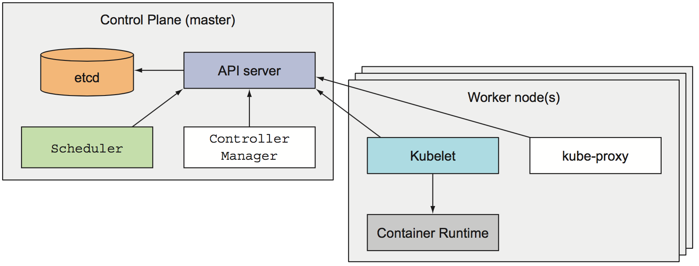
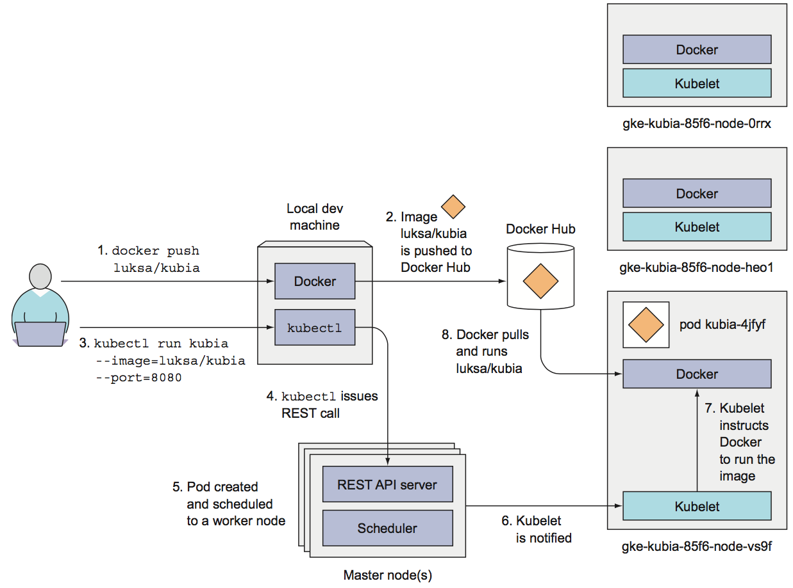

# Kubernetes

> **Kubernetes** is a system for automating deployment, scaling, and management of containerized applications

Resources

* [Documentation](https://kubernetes.io/docs/home)

* [Offical Blog](https://kubernetes.io/blog)

* [Kubernetes in Action](https://amzn.to/2yXEGWx) (2017) by Marko Lukša (Book)

* [Kubernetes by Example](http://kubernetesbyexample.com)

* [Kubernetes comic](https://cloud.google.com/kubernetes-engine/kubernetes-comic)

* [Running akka-cluster on Kubernetes](https://blog.softwaremill.com/running-akka-cluster-on-kubernetes-e4cd2913e951)

* [Kubernetes: The Surprisingly Affordable Platform for Personal Projects](http://www.doxsey.net/blog/kubernetes--the-surprisingly-affordable-platform-for-personal-projects)

* [Kubernetes from scratch to AWS with Terraform and Ansible](https://opencredo.com/kubernetes-aws-terraform-ansible-1)

* YouTube channels: [Kubernetes](https://www.youtube.com/channel/UCZ2bu0qutTOM0tHYa_jkIwg) and [Cloud Native Computing Foundation](https://www.youtube.com/channel/UCvqbFHwN-nwalWPjPUKpvTA)

## Architecture

At the hardware level, a Kubernetes cluster node can be

* a *master* node, which hosts the **Kubernetes Control Plane** that manages the state of the cluster
    - The **Kubernetes API Server** to communicate with the cluster
    - The **Scheduler**, which schedules apps (assigns a worker node to each deployable component)
    - The **Controller Manager**, which performs cluster-level functions, such as replicating components, keeping track of worker nodes handling node failures, and so on
    - **etcd**, a reliable distributed data store that persistently stores the cluster configuration
* a *worker* nodes that run containerized applications
    - Docker, rkt, or another **container runtime**, which runs containers
    - The **Kubelet**, which talks to the API server and manages containers on its node
    - The **Kubernetes Service Proxy (kube-proxy)**, which load-balances network traffic between application components



* To run an application in Kubernetes, it needs to be packaged into one or more container images, those images need to be pushed to an image registry, and then a description of the app posted to the Kubernetes API Server
* When the API server processes the app's description, the Scheduler schedules (pods are run immediately) the specified groups of containers onto the available worker nodes based on computational resources required by each group and the unallocated resources on each node at that moment
* The Kubelet on those nodes then instructs the Container Runtime (Docker, for example) to pull the required container images and run the containers
* Once the application is running, Kubernetes continuously makes sure that the deployed state of the application always matches the description you provided
* To allow clients to easily find containers that provide a specific service, it's possible to tell Kubernetes which containers provide the same service and Kubernetes will expose all of them at a single static IP address and expose that address to all applications running in the cluster
* User interacts with the cluster through the `kubectl` command line client, which issues REST requests to the Kubernetes API server running on the master node



* One of the most fundamental Kubernetes principles is that instead of telling Kubernetes exactly what actions it should perform, you're only *declaratively changing the desired state* of the system and letting Kubernetes examine the current actual state and *reconcile* it with the desired state
* A **label** is an arbitrary key-value pair you attach to a resource, which is then utilized when selecting resources using *label selectors* and a resource can have more than one label
* **Annotations** are key-value pairs like labels, but they aren't meant to hold identifying information and can hold up to 256 KB
* Using multiple **namespaces** allows to split complex systems with numerous components into smaller distinct groups and resource names only need to be unique within a namespace
* A **pod** is a group of one or more tightly related containers that will always run together on the same worker node and in the same Linux namespace(s). Each pod is like a separate logical machine with its own IP, hostname, processes, and so on, running a single application
* **Services** represent a static location for a group of one or more pods that all provide the same service. Requests coming to the IP and port of the service will be forwarded to the IP and port of one of the pods belonging to the service at that moment
* A **ReplicationController** is a resource that ensures its pods are always kept running and an exact number of pods always matches its label selector, even if a node disappears. It's made by
    - a *label selector*, which determines what pods are in the ReplicationController's scope
    - a *replica count*, which specifies the desired number of pods that should be running
    - a *pod template*, which is used when creating new pod replicas
* A **ReplicaSet** behaves exactly like a ReplicationController (old), but it has more expressive pod selectors
* A **DaemonSet** is mostly for specific case like infrastructure-related pods that perform system-level operations in which a pod must run on each and every node in the cluster and each node needs to run exactly one instance of the pod, for example log collector and resource monitor
* *Resource* definition example

```
apiVersion: v1
# type of resource
kind: Pod
# includes the name, namespace, labels, and other information about the pod
metadata:
  ...
# contains the actual description of the pod's contents,
# such as the pod's containers, volumes, and other data
spec:
  ...
# contains the current information about the running pod,
# such as what condition the pod is in, the description and status of each container,
# and the pod's internal IP and other basic info
status:
  ...
```

* The Kubelet on the node hosting the pod can check if a container is still alive through **liveness probes** using *httpGet*, *tcpSocket* or *exec*. Exit code is a sum of `128 + N` e.g. `137 = 128 + 9` (SIGKILL) or `143 = 128 + 15` (SIGTERM). Always remember to set an initial delay *initialDelaySeconds*
* TODO **readiness probes**

## Setup

Requirements

* [Minikube](https://github.com/kubernetes/minikube)
* [VirtualBox](https://www.virtualbox.org)

Local cluster
```bash
# verify installation
minikube version

# lifecycle
minikube start --vm-driver=virtualbox
minikube stop
minikube delete

# dashboard
export NO_PROXY=localhost,127.0.0.1,$(minikube ip)
minikube dashboard

# access
minikube ssh
docker ps -a

# reuse the minikube's built-in docker daemon
eval $(minikube docker-env)
```

Basic
```bash
# verify installation
kubectl version

# cluster info
kubectl cluster-info
kubectl get nodes
kubectl describe nodes
kubectl config view

# namespace
kubectl create namespace <NAMESPACE_NAME>
kubectl get namespaces
kubectl config view | grep namespace
kubectl delete namespace <NAMESPACE_NAME>

# current namespace
kubectl config current-context

# switch namespace
kubectl config set-context $(kubectl config current-context) --namespace=<NAMESPACE_NAME>

# create resources from file
kubectl create -f <FILE_NAME>.yaml

# explain fields
kubectl explain pod
kubectl explain service.spec

# edit resource (vim)
kubectl edit pod <POD_NAME>
```

Simple deployment
```bash
# deploy demo app
kubectl run kubernetes-bootcamp \
  --image=gcr.io/google-samples/kubernetes-bootcamp:v1 \
  --port=8080 \
  --labels='app=kubernetes-bootcamp'

# update app
kubectl set image deployments/kubernetes-bootcamp \
  kubernetes-bootcamp=jocatalin/kubernetes-bootcamp:v2

# verify update
kubectl rollout status deployments/kubernetes-bootcamp
kubectl rollout history deployments/kubernetes-bootcamp

# undo latest deployment
kubectl rollout undo deployments/kubernetes-bootcamp

# list deployments
kubectl get deployments
```

Pod and Container
```bash
# proxy cluster (open in 2nd terminal)
kubectl proxy

# pod name
export POD_NAME=$(kubectl get pods -l app=kubernetes-bootcamp -o go-template --template '{{range .items}}{{.metadata.name}}{{"\n"}}{{end}}')
echo POD_NAME=$POD_NAME

# verify proxy
http :8001/version
http :8001/api/v1/proxy/namespaces/default/pods/$POD_NAME/

# view logs
kubectl logs $POD_NAME
kubectl logs <POD_NAME> -c <CONTAINER_NAME>
kubectl logs <POD_NAME> --previous

# execute command on container
kubectl exec $POD_NAME printenv
kubectl exec $POD_NAME ls -- -la

# access container
kubectl exec -it $POD_NAME bash

# verify label
kubectl describe pods $POD_NAME

# list containers inside pods
kubectl describe pods

# list pods
kubectl get pods

# list pods and nodes
kubectl get pods -o wide

# list pods with labels
kubectl get po --show-labels
kubectl get pods -L <LABEL_KEY>

# filter with equality-based labels
kubectl get pods -l app=kubernetes-bootcamp
kubectl get pods -l app
kubectl get pods -l '!app'

# filter with set-based labels
kubectl get pods -l 'app in (kubernetes-bootcamp)'

# add/update labels manually
kubectl label po <POD_NAME> <LABEL_KEY>=<LABEL_VALUE>
kubectl label po <POD_NAME> <LABEL_KEY>=<LABEL_VALUE> --overwrite

# annotate
kubectl annotate pod <POD_NAME> <LABEL_KEY>=<LABEL_VALUE>

# print definition
kubectl get pod <POD_NAME> -o json
kubectl get pod <POD_NAME> -o yaml
# output json
kubectl get pod <POD_NAME> -o json | jq '.metadata'
# output json
kubectl get pod <POD_NAME> -o yaml | yq '.metadata.annotations'
# output yaml
kubectl get pod <POD_NAME> -o yaml | yq -y '.metadata.annotations'

# specify namespace
kubectl get ns
kubectl get pod --namespace kube-system

# (debug) forward a local network port to a port in the pod (without service)
kubectl port-forward <POD_NAME> <LOCAL_PORT>:<POD_PORT>

# delete (sends SIGTERM to containers and waits 30 seconds, otherwise sends SIGKILL)
kubectl delete po <POD_NAME>
kubectl delete pod -l <LABEL_KEY>=<LABEL_VALUE>
kubectl delete po --all
```

Service
```bash
# list services
kubectl get services

# create service
kubectl expose deployment/kubernetes-bootcamp \
  --type="NodePort" \
  --port 8080

# service info
kubectl describe services/kubernetes-bootcamp

# expose service
export NODE_PORT=$(kubectl get services/kubernetes-bootcamp -o go-template='{{(index .spec.ports 0).nodePort}}')
echo NODE_PORT=$NODE_PORT

# verify service
curl $(minikube ip):$NODE_PORT

# add 4 replicas
kubectl scale deployments/kubernetes-bootcamp --replicas=4

# info
kubectl get pod,deployment,service
kubectl get pods -o wide
kubectl describe deployments/kubernetes-bootcamp

# cleanup
kubectl delete deployment,service kubernetes-bootcamp
# all (means all resource types)
# --all (means all resource instances)
kubectl delete all --all
```

Other
```bash
# replication controller
kubectl get rc
kubectl get replicationcontroller

# replica set
kubectl get rs
kubectl get replicaset
```

<br>
